# The adventure of the Damned Willow Forest!

* This is a text adventure game based off of my own imagination. Worth mentioning is the fact that it has some inspiration taken from The lord of the rings. The player is presented with the context of them standing outside of a forest, and they have to go through it if they want to go back home. The sign at the edge of the forest explains that they will encounter some obstacles on their way. Well inside the player will meet everythig between a goblin to a witch, each of these characters will offer something valuable. At the end the player will meet a Wizard, he wants to know if the player has seen his treasure, and if so the Wizard will help the player to get to the end of the forest so that he can go home, if not the player has to get over the wild stream by themself.

## Flowchart

* I have created a flowchart to help myself plan out the bascis of the game. This helped me a lot when I started to plan out which path was connected to which and so on. When looking at the chart one can understand the basic knowledge of what to do.

* The original one I made was not the one that resulted in the finished product, I realised that some of the steps that I first planned out was a bit unnecessary. And I also felt that i wanted to make different paths for frequent players. This means that the frequent players has the chance of experiencing different stories each time they play. 

* This is the one I ended up using:
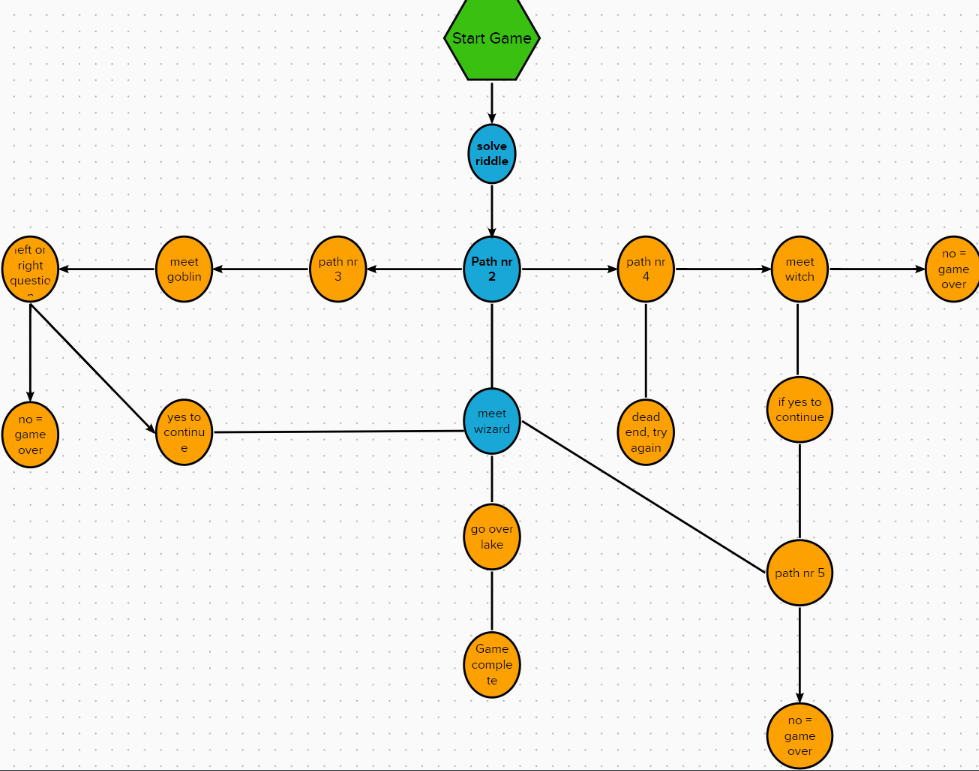

## User Experience

- #### First time user goals
* As I first time user I want to know what the game is about
* As a first time user I want to understand the basic knowledge of the game
* As a first time user I want to understand how to continue the game
* As a first time user I want to be able to understand the instructions
* As a first time user I want to be able to explore all parts of the game
* As a first time user I want to have fun!

- ### Returning user goals
* As a returning visitor I want to be able to beat the game faster than before.
* As a returning visitor I want to try to take another path and see where that leads me.
* As a returning visitor I want to be able to make my own decisions

## Features and the game itself

### Welcome text

* At the begining the user is welcomed by a header saying "It's time for an adventure!" and underneath is a short text about the game and what the user should expect, it also ask you about your name.

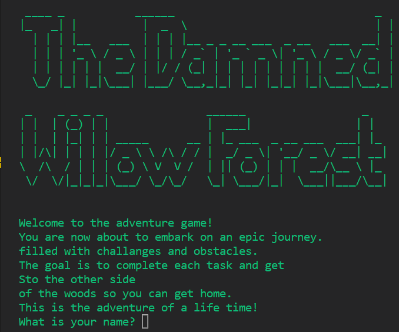

### Welcome text 2

* The game continues with another informative text, welcoming you to 
the game and give you more information about your upcoming journey.

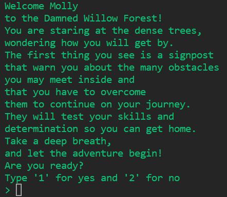

### Path ways

* Different pathways will be presented during the game. Each one will take the player deeper inside the woods and each one will give the player the oppertunity to choose where to go. One patway has two pathways connected to it, if the player choose path 1 they will meet a goblin and if the player choose path 2 they will eventueally meet a witch.

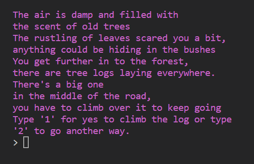
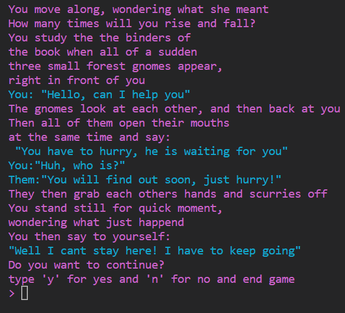

### Solve riddle

* The first obstacle is a riddle, the player has to solve it before they can continue. If they get the riddle wrong they loose the game.

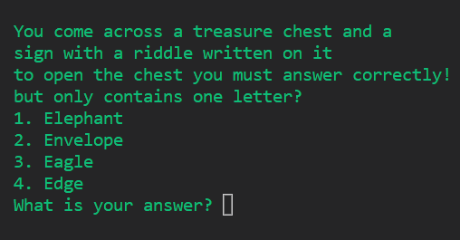

### Meeting the characters

* The player will get the chance of meeting a goblin, the player has to fight it and if they win they get a badge of honor to collect and then they can continue to meet the wizard. 

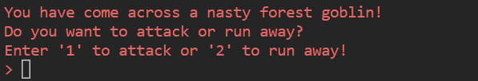

* The player will also get the chance of meeting a witch, she will give the player a few words of wisdom and then proceed to give them a "Book of wisdom" and the player collects it as well. 

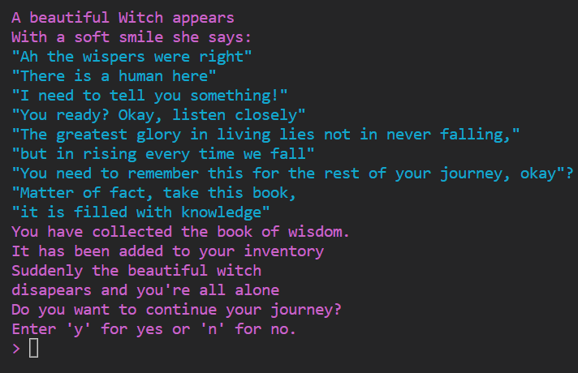

* The player will then get the chance of meeting a wizard, he will ask if the player has seen his treasure. If so and the player gives i to him he will help them to the end of the forest. If not - he says something snarky and disappears.

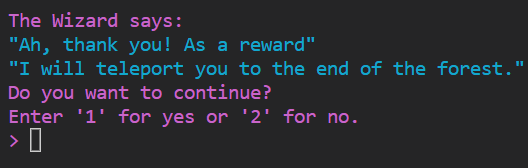

### The wild stream

* If the player doesn't help the wizard they are left alone to deal with the wild stream.
* It is not that hard to get passed it and the player will soon after that see the end of the forest.

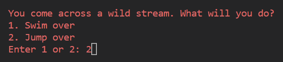

### The end of the forest

* When they arrive at the end they are greeted by a couple of forest gnomes.
* The gnomes chant and exclaims happieness that the player made it out alive.
* The player will after that be informed with that the game is over and they have the oppertunity to play again if they want.

### Error messages

* If the player enters an invalid answer they will be presented with an error message.
* They can look a bit different but here are a few of them:

1. 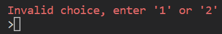

2. 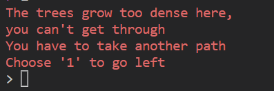

### Game over

* If the player decides to end game they will be infomred that the game is over. 
* There is a chance to retry the game if the player wants to:

1. 
2. 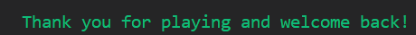

### Features left to implement
* I would like to add some more background story, to make it a bit more interesting
* I would like to add some music
* I would like to add so that the player can add to their health
* I would like to add a healing potion if the player died
* I would like to add one more obstacle to get through
* I would like to add a typing function, so that text rolls out on the 
screen when the player enters a new section.

### Styling

* I decided to add some color to the text to make it easier for the player.
* It mostly had to do with it looking a bit cooler, and so that it would be
easier on the eye if there was something separating the different functions 
and sections.
* The text is green when something is good/the game is just starting 
* The dialogues are a cyan color
* When meeting the goblin/error messages are red. (To indicate that there is danger/ that something is bad.)
* And the narrative text are a magenta color.

Here is an image of the magenta narrative text and the cyan dialouge:

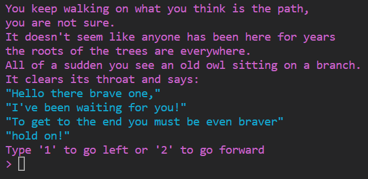

## Quiz model

* I used a quiz model for this game, giving the player options while choosing to proceed.
* The game collects the information that the player gives while choosing and 
sends the player in the right direction.

## Technologies Used

* [GitHub](https://github.com/) - to host the repositories.
* [Gitpod](https://www.gitpod.io/) - as the IDE for the application.
* [Python](https://docs.python.org/3/contents.html) - primary language of the application.
* [Stack overflow](https://stackoverflow.com/) - basic explaining 
* [Patorjk](https://patorjk.com/) - for the header
* [ANSI](https://gist.github.com/Prakasaka/219fe5695beeb4d6311583e79933a009) - colors for the text
* [ANSI](https://stackoverflow.com/questions/4842424/list-of-ansi-color-escape-sequences) - also used for color changes
* [PEP8](http://pep8online.com/) - for testing and validating the code.

## Testing

### Manual testing

* I've thoroughly tested every section and typing section as well as I can
* You can type in any name you want when the game begins
* When asked a question you must enter the options written on the screen
* When asked the riddle you must answer correctly otherwise the game ends
* Every path/character is well connected
* Wvery path leads to the wizard
* You always get the chance to end game

### validator testing

* I tested it through the python validator and no errors or warnings were shown. Everything works perfectly, no errors were returned from pep8online.com

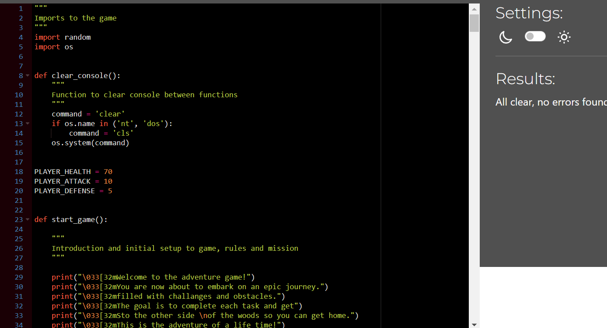

### Unfixed bugs
* There are no unfixed bugs
* Partner and friends have had their turn on the game to get the chance to break it, and with their help I made it foolproof.

## Deployment

### [Heroku](https://www.heroku.com/) Deployment:

* Ensure your requirements.txt file has the required dependencies. To do this you can use the following
code in your IDE: pip3 freeze > requirements.txt
* Create or login to you Heroku account
* Navigate to Dashboard
* Click and select "Create app" in the middle of the page
* Enter a unique name for you app
* Select region and the "create app"

### App deployment
* Navgiate to the deploy section
* Scroll down to the "deployment method" and select "Github"
* Authorise the connection
* Search for the repository name you've chosen
* Make sure you have selected the correct branch (master/main), and select the method you desire.

### To create a clone of this project

* Go to GitHub
* Under the repository's name you can click on the code tab
* In the clone with HTTPS section you click on the clipboard icon 
to copy the given URL
* in our IDE you open Git Bash
* Change the current working directory to the location where you want the cloned directory to be made
* Type git clone, and then you paste URL copied from GitHub
* Press enter and the local clone will be created

## Credits

### content
* I used Code Institute's Love Sandwiches Walkthrough for guidance with code structure and deployment steps.

### Acknowledgements
* This adventure game was created as Portfolio Project 3 for the the Full Stack Software Developer diploma by the [Code Institute](https://codeinstitute.net/). It was with great pleasure to explore the basics of most games and to achieve some new skills.
* I would like to thank my mentor [Gareth McGirr](https://www.linkedin.com/in/gareth-mcgirr/) for helping me and guiding through this project, the tutors at code institute for being extremely helpful considering my many questions and to my partner who helped me with the storyline.

Molly Adamsson, 2023